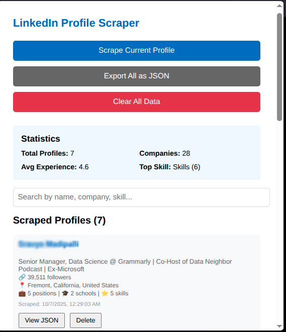
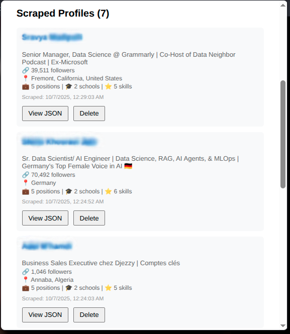

# LinkedIn Profile Scraper - Chrome Extension

A Chrome extension that automatically scrapes LinkedIn profiles and stores the data locally for personal analysis.


## ✨ Features

- 🔄 **Auto-scrape** profiles when visiting LinkedIn
- 📊 **Comprehensive data extraction**:
  - Personal info (name, headline, location, profile picture)
  - About section
  - Work experience with employment type
  - Education history
  - Skills with endorsement counts
  - Connections count
- 🔍 **Search & filter** across all profiles
- 📈 **Statistics dashboard** with insights
- 💾 **Export to JSON** for analysis
- ⚡ **Smart expansion** - auto-clicks "Show all" buttons
- 🖼️ **Profile pictures** in popup interface

## 🚀 Installation

1. Clone this repository:
   ```bash
   git clone https://github.com/yourusername/linkedin-profile-scraper.git
   ```

2. Open Chrome and go to `chrome://extensions/`

3. Enable **Developer mode** (top-right toggle)

4. Click **Load unpacked** and select the project folder

5. Pin the extension to your toolbar (optional)

## 📖 Usage

### Automatic Scraping

1. Log into LinkedIn
2. Visit any profile: `https://www.linkedin.com/in/username/`
3. Extension auto-scrapes (check console for success message)

### View & Manage Profiles

1. Click the extension icon
2. Browse scraped profiles with search
3. View statistics dashboard
4. Export all data as JSON
5. Delete individual or all profiles

### Extension Interface

**Statistics Dashboard**



**Profile List**



## 📊 Data Structure

```json
{
  "timestamp": "2025-10-06T23:14:45.752Z",
  "profileId": "username",
  "name": "John Doe",
  "headline": "Software Engineer",
  "location": "San Francisco, CA",
  "profilePicture": "https://...",
  "connections": "500+ connections",
  "currentPosition": "Software Engineer",
  "currentCompany": "Company",
  "about": "...",
  "experience": [{
    "title": "Software Engineer",
    "company": "Company",
    "employmentType": "Full-time",
    "duration": "Jan 2020 - Present",
    "location": "San Francisco",
    "description": "..."
  }],
  "education": [{
    "school": "University",
    "degree": "BS Computer Science",
    "duration": "2016 - 2020"
  }],
  "skills": [{
    "name": "JavaScript",
    "endorsements": "50 endorsements"
  }]
}
```

## 🛠️ Tech Stack

- **Manifest V3** - Latest Chrome extension standard
- **Vanilla JavaScript** - No frameworks
- **Chrome Storage API** - Local persistence
- **Content Scripts** - DOM scraping
- **Service Worker** - Background processing

## 📁 Project Structure

```
linkedin-profile-scraper/
├── manifest.json     # Extension config
├── content.js        # Scraping logic
├── background.js     # Storage management
├── popup.html        # UI markup
├── popup.js          # UI logic
├── icons/            # Extension icons
└── README.md         # Documentation
```

## ⚠️ Legal & Privacy

- **For personal use only**
- All data stored **locally** (no external servers)
- LinkedIn's TOS prohibit automated scraping
- Use at your own risk
- Not affiliated with LinkedIn

## 🔧 Customization

### Modify Scraped Fields

Edit `scrapeProfileData()` in `content.js` to add/remove fields.

### Disable Auto-Scrape

Comment out the auto-scrape code at the end of `content.js`:

```javascript
// if (document.readyState === 'loading') {
//   document.addEventListener('DOMContentLoaded', autoScrape);
// } else {
//   autoScrape();
// }
```

## 🐛 Known Limitations

- Only works on `/in/` profile URLs
- Cannot scrape private/restricted profiles
- LinkedIn HTML changes may break selectors
- Some lazy-loaded content might be missed

## 🤝 Contributing

Contributions welcome! Please open an issue or PR.


## 📧 Contact

Questions? Open an issue or reach out!

---

**⭐ If you find this useful, please star the repo!**

**Disclaimer:** Educational purposes only. Not responsible for TOS violations or account issues.
